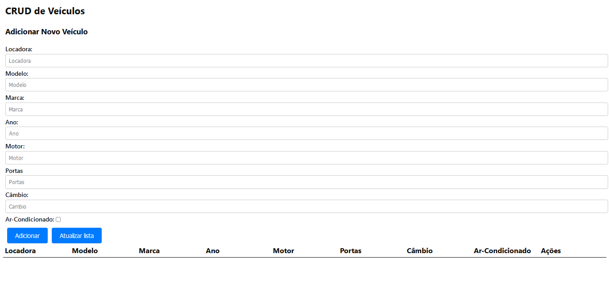

# API Locadora de Veículos (Resolução do Desafio Rentcars)
 O projeto consiste em um aplicativo CRUD (Create, Read, Update, Delete) desenvolvido em Node.js, que permitirá a gestão de veículos em uma locadora de carros. Cada veículo terá informações detalhadas, incluindo ID, locadora, modelo, marca, ano, motor, número de portas, tipo de câmbio, presença de ar-condicionado e datas de criação e atualização.

# E como funciona? :thinking:

- API com o intuito de adicionar veículos e armazená-los em um banco de dados :computer:
- Nessa API, é possível adicionar novos veículos (contanto que todos os dados dos inputs sejam preenchidos)
- Atualizar a lista de veículos, fazendo com que o dado cadastrado seja visível logo abaixo, em uma tabela
- Excluir os dados que foram exibidos abaixo, caso você queira

# Tecnologias utilizadas no projeto :bulb:
- Node.js
- Dependências do Node: Express, mysql2, Sequelize, Nodemon
- Vue.js
- Bibliotecas: Axios, UUID

# O que você vai precisar:
- Node JS LTS
- npm
- Docker
- Dependências do Node: Express, mysql2, Sequelize, Nodemon
- VueJS

# Aprendendo a utilizar o projeto :pencil:
<h3>Primeiro, vamos clonar o projeto com o seguinte comando:</h3><br>

`git clone url_do_repositorio`

<h3>Agora, considerando que você já tenha todas as dependências baixadas, o npm e o Docker instalado na sua máquina,
realize a seguinte etapa: </h3>

<h3>No terminal, digite: </h3> <br>

`cd my_app` <br>

`cd back-end` <br>

E com o Docker aberto, rode o seguinte código para criar o banco de dados:

```bash
mkdir /tmp/mysql-data
docker run --name basic-mysql --rm -v /tmp/mysql-data:/var/lib/mysql -e MYSQL_ROOT_PASSWORD=ANSKk08aPEDbFjDO -e MYSQL_DATABASE=testing -p 3307:3306 -it mysql:8.0
```
(caso dê algum problema, tente somente a segunda linha de código)

<h3>Certifique-se de utilizar o seguinte comando antes de seguirmos para a próxima etapa: </h3>

`npm install`

No docker, você deve conseguir visualizar um banco de dados chamado 'basic-mysql' 

<h3>Feito isso, utilize os seguintes comandos para realizarmos a migration do projeto</h3>

`cd src`

`npx sequelize-cli db:migrate`

(esse comando irá pedir a instalação do sequelize-cli direto pelo terminal, apenas aceite)

<h3>Depois da migration ser efetuada com sucesso, rode esse comando: </h3>

`npx sequelize db:seed:all`

No src do projeto, rode o seguinte comando para abrirmos o servidor:<br>


`npm run start`

Isso deverá inicializar um servidor na porta (3333)

<h1>Com o servidor aberto e os dados mostrados, <br> é hora de irmos para o front-end! :tada: </h1>


<h2> Proposta de resolução (sem dados)</h2>



  
 
